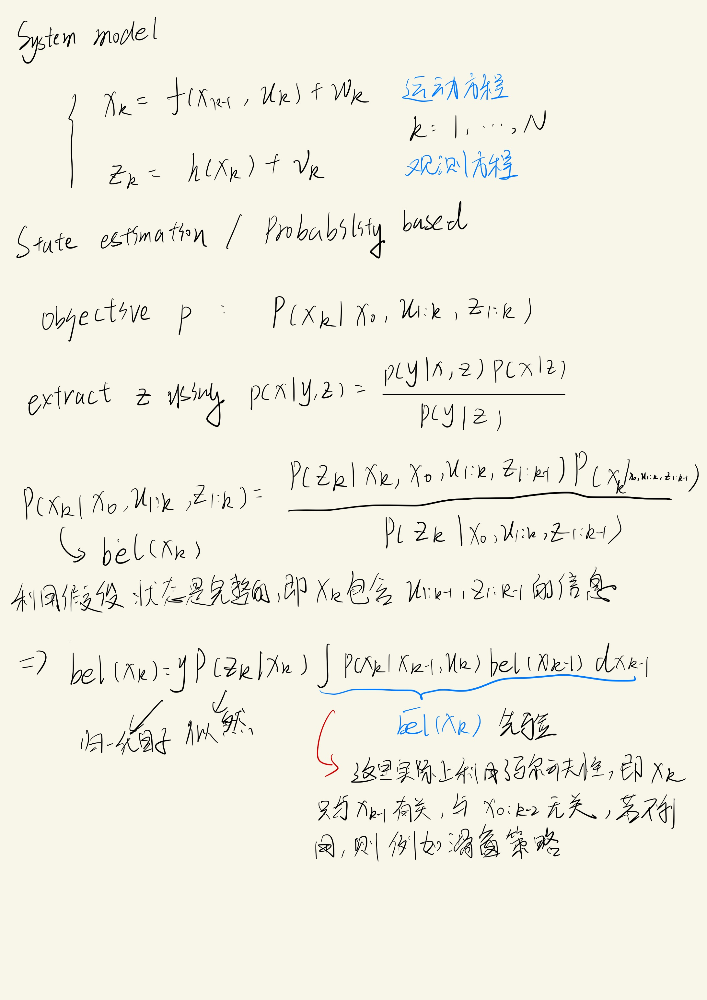
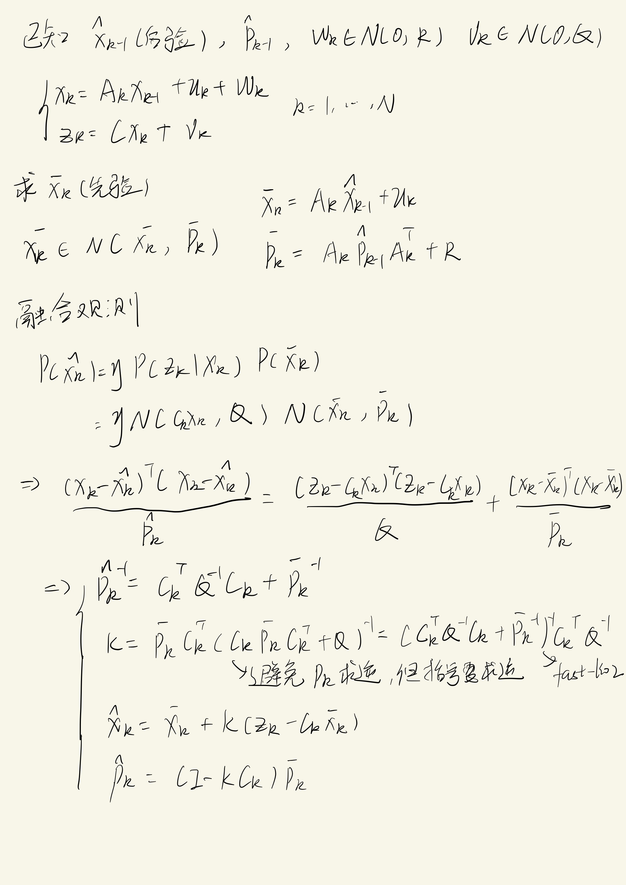
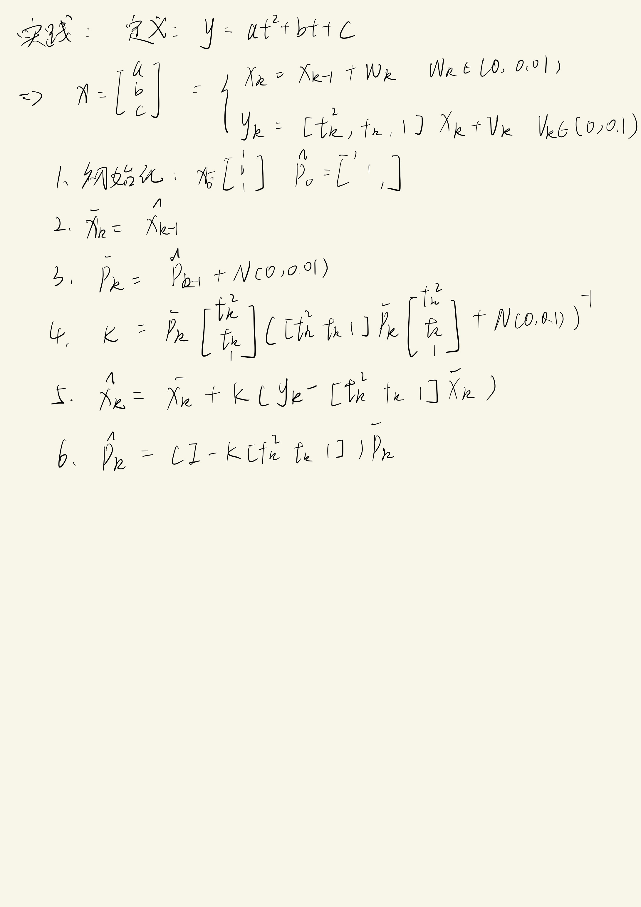

## Kalman Filter

This repository contains a simple Kalman Filter implementation in C++. In this code, I compare the Kalman Filter with least squares method to estimate the parameters of a linear time-varying system.

Interesting results can be obtained by modifying the hyper-parameter "M_DIM", which reflects the characteristics of the observability of the system.

## Run

```bash
mkdir build
cd build
cmake ..
make
./poly_fitting
```

### Linear Kalman Filter Notes

#### 1. State Space Model



#### 2. Kalman Filter Derivation



#### 3. Curve Fitting Example

